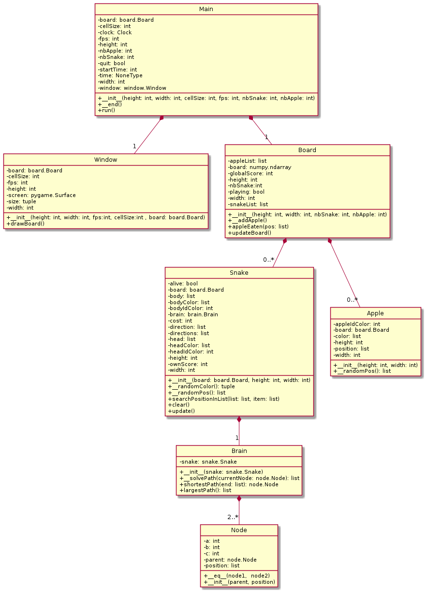
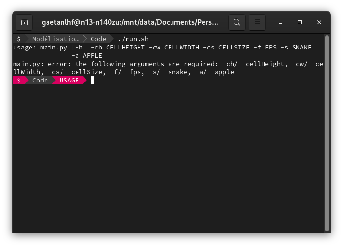
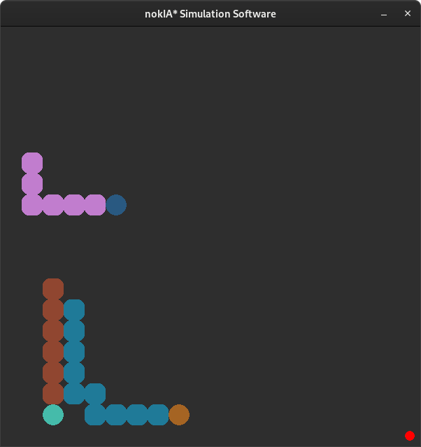
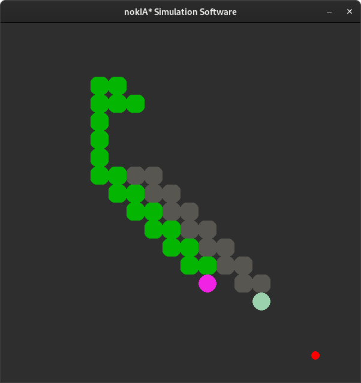
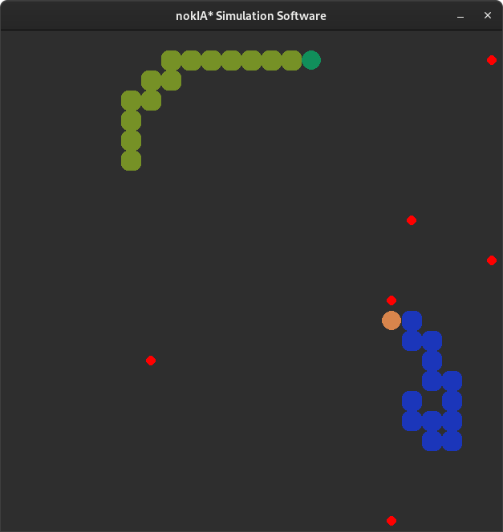
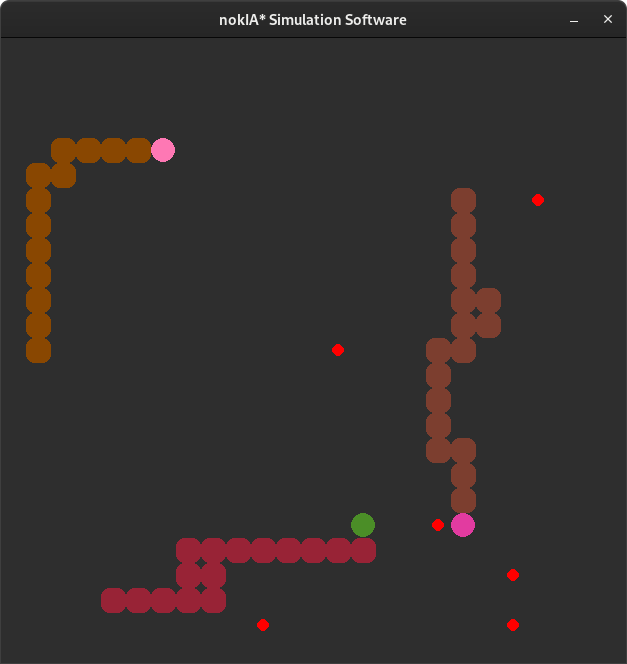
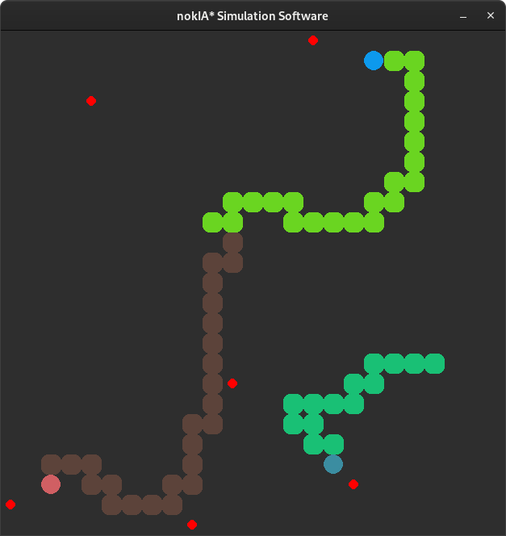
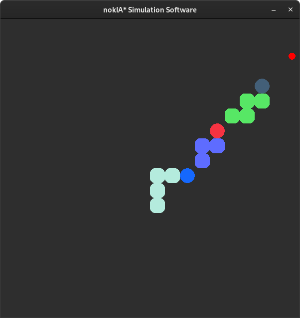
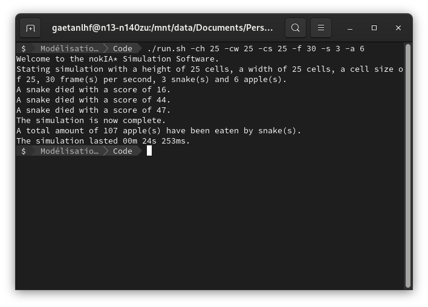

# nokIA*

## Introduction
A snake simulation program, based on an A* algorithm, with an unlimited number of snakes and apples.  
The name of the program is a pun between "Nokia", "IA" (artificial intelligence in French) and "A*" (the algorithm).

## Specifications
### Setup and execution via a terminal
This application will have to be run and set up from a terminal.  
The user can choose a number of cells in height and width as well as the size of the cells, the number of frames per second (which determines the speed of the application), the number of snakes and the number of apples.  
At runtime, a message indicating the chosen parameters should be displayed in the terminal.

### The simulation is displayed in a window
A window should open, showing the current simulation.  
The size of the window is determined by the number of cells in height and width and by the size of the cells.

### Snakes are displayed
The snakes are initially arranged randomly in the window. The head of a snake is represented by a circle and the body by a square with rounded edges.  
Both of these elements must have a randomly generated colour.

### Apples are displayed
Apples, represented by small red circles, should be displayed at random positions in the window.

### A snake has its own intelligence
With each movement of a snake, it must find the nearest apple and the ideal path to it, remembering to take into account the obstacles.  
To find the ideal path to the apple, its intelligence must be built on an A* algorithm.  
This algorithm finds the shortest path between the node corresponding to the position of the snake's head and the node corresponding to the position of the apple.  
It then uses a heuristic evaluation on each node to estimate the best path and then visits the nodes in order of this heuristic evaluation.

### A snake earns a point
When a snake eats an apple, corresponding to the collision between the snake's head and the apple, it gains a point and a rounded square is added to its body.  
A new apple is then displayed in a new random position.

### A snake dies
When a snake collides with an obstacle (window boundary, another snake or its own body), or when no solution is found, the snake disappears and a message indicating that a snake is dead and its number of points should be displayed in the terminal.

### End of simulation
When all the snakes are dead, the simulation window ends.  
The total number of apples eaten and the duration of the simulation should appear in the terminal.

## Class diagram

## Screenshots
  
  
  
  
  
  
  
